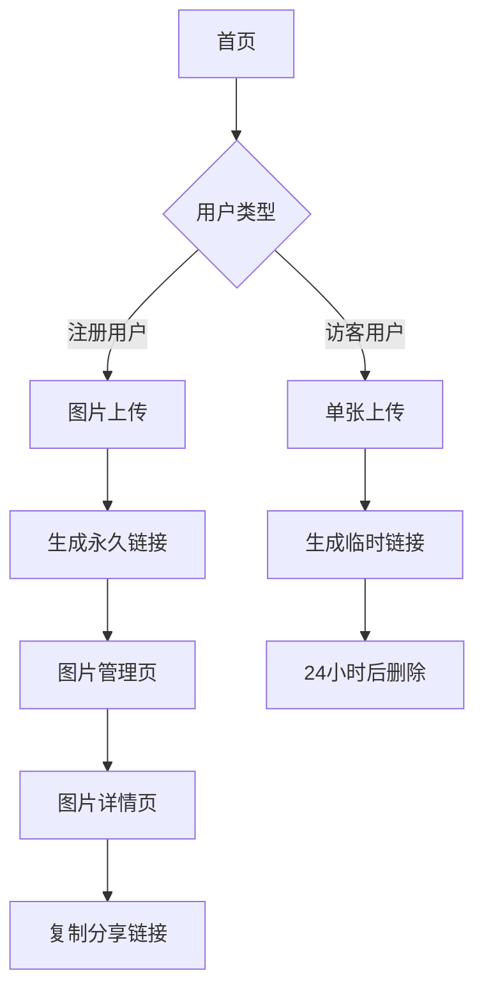

## 1. 产品概述
在线图床工具是一个简单易用的图片托管服务平台，允许用户上传、管理和分享图片。
- 解决用户在不同平台分享图片时的存储和链接问题
- 面向需要图片托管服务的个人用户、博主、开发者等群体
- 提供快速上传、预览和分享功能，支持生成永久有效的图片链接

## 2. 核心功能

### 2.1 用户角色
| 角色 | 注册方式 | 核心权限 |
|------|----------|----------|
| 普通用户 | 邮箱注册 | 上传图片、查看个人图片、生成分享链接 |
| 访客用户 | 无需注册 | 仅限上传单张图片、24小时有效期 |

### 2.2 功能模块
我们的图床工具包含以下主要页面：
1. **首页**: 图片上传区域、上传历史、使用说明
2. **图片管理页**: 个人图片列表、批量操作、搜索筛选
3. **图片详情页**: 图片预览、分享链接、删除操作

### 2.3 页面详情
| 页面名称 | 模块名称 | 功能描述 |
|-----------|-------------|---------------------|
| 首页 | 上传区域 | 支持拖拽上传、点击选择文件、批量上传多张图片、显示上传进度 |
| 首页 | 历史记录 | 展示最近上传的图片缩略图、显示上传时间、提供快速复制链接按钮 |
| 首页 | 使用说明 | 简洁的使用指南、API接口说明、常见问题解答 |
| 图片管理页 | 图片列表 | 网格/列表视图切换、分页加载、按时间排序、支持关键词搜索 |
| 图片管理页 | 批量操作 | 全选/反选、批量删除、批量复制链接、打包下载 |
| 图片详情页 | 图片预览 | 原图展示、自适应大小、支持放大缩小、显示图片信息 |
| 图片详情页 | 分享功能 | 生成直链、Markdown格式、HTML格式、BBCode格式、一键复制 |
| 图片详情页 | 管理操作 | 删除图片、编辑图片信息、查看访问统计 |

## 3. 核心流程
用户主要操作流程如下：

**普通用户流程**：
1. 用户访问首页 → 2. 上传图片 → 3. 系统自动生成图片链接 → 4. 用户复制链接使用 → 5. 可在管理页查看历史记录

**访客用户流程**：
1. 访客访问首页 → 2. 上传单张图片 → 3. 获得临时链接（24小时有效）→ 4. 链接过期后自动删除

## 4. 用户界面设计

### 4.1 设计风格
- **主色调**: 天蓝色 (#3498db) 作为品牌色，白色背景，灰色辅助
- **按钮样式**: 圆角矩形，扁平化设计，悬停效果
- **字体**: 系统默认字体，主要文字14-16px，标题18-24px
- **布局风格**: 卡片式布局，顶部导航栏，响应式网格
- **图标风格**: 简洁线性图标，使用开源图标库

### 4.2 页面设计概览
| 页面名称 | 模块名称 | UI元素 |
|-----------|-------------|-------------|
| 首页 | 上传区域 | 大尺寸拖拽区域（400x300px）、虚线边框、上传按钮居中、进度条动画 |
| 首页 | 历史记录 | 网格布局（每行4-6张缩略图）、悬停显示操作按钮、时间戳显示 |
| 图片管理页 | 图片列表 | 网格/列表切换按钮、搜索框置顶、分页控件底部、批量操作工具栏 |
| 图片详情页 | 预览区域 | 图片居中显示、最大宽度1200px、深色背景、左右切换箭头 |
| 图片详情页 | 分享区域 | 多格式链接展示、一键复制按钮、二维码生成、社交媒体分享 |

### 4.3 响应式设计
采用桌面端优先设计，适配移动端：
- 桌面端：完整功能展示，多栏布局
- 平板端：双栏布局，适当缩小图片尺寸
- 手机端：单栏布局，触摸优化，简化操作流程

### 4.4 性能优化
- 图片压缩：上传时自动压缩大图片
- 懒加载：图片列表采用懒加载技术
- CDN加速：使用CDN分发图片资源
- 缓存策略：浏览器缓存和服务器缓存结合