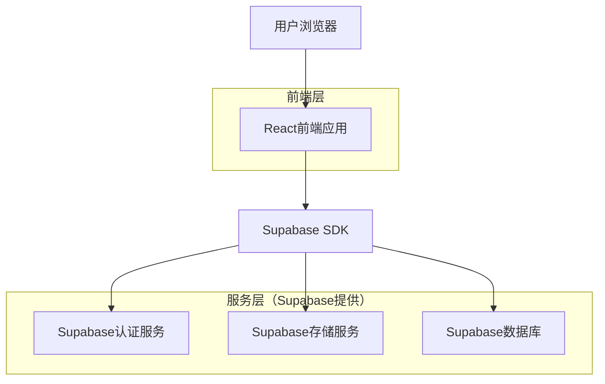
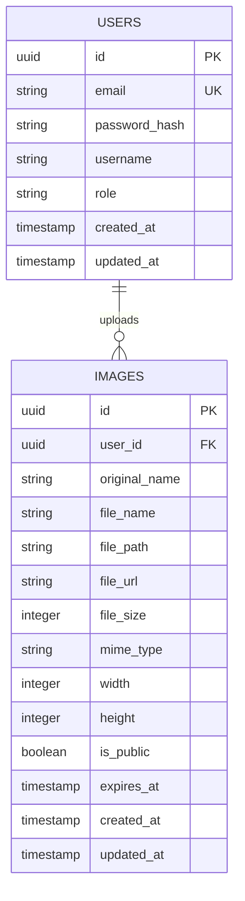

## 1. 架构设计



## 2. 技术描述

- 前端：React@18 + TailwindCSS@3 + Vite
- 初始化工具：vite-init
- 后端：Supabase（提供认证、存储、数据库功能）
- 主要依赖：
  - @supabase/supabase-js: Supabase客户端SDK
  - react-dropzone: 拖拽上传组件
  - react-router-dom: 路由管理
  - lucide-react: 图标库
  - react-hot-toast: 消息提示

## 3. 路由定义

| 路由 | 用途 |
|-------|---------|
| / | 首页，图片上传和历史记录 |
| /login | 登录页面，用户认证 |
| /register | 注册页面，新用户注册 |
| /dashboard | 图片管理页面，个人图片列表 |
| /image/:id | 图片详情页面，预览和分享 |
| /api-docs | API文档页面，接口说明 |

## 4. 数据模型

### 4.1 数据模型定义


### 4.2 数据定义语言

用户表 (users)
```sql
-- 创建用户表
CREATE TABLE users (
    id UUID PRIMARY KEY DEFAULT gen_random_uuid(),
    email VARCHAR(255) UNIQUE NOT NULL,
    password_hash VARCHAR(255) NOT NULL,
    username VARCHAR(100) NOT NULL,
    role VARCHAR(20) DEFAULT 'user' CHECK (role IN ('user', 'admin')),
    created_at TIMESTAMP WITH TIME ZONE DEFAULT NOW(),
    updated_at TIMESTAMP WITH TIME ZONE DEFAULT NOW()
);

-- 创建索引
CREATE INDEX idx_users_email ON users(email);
CREATE INDEX idx_users_username ON users(username);
```

图片表 (images)
```sql
-- 创建图片表
CREATE TABLE images (
    id UUID PRIMARY KEY DEFAULT gen_random_uuid(),
    user_id UUID REFERENCES users(id) ON DELETE CASCADE,
    original_name VARCHAR(255) NOT NULL,
    file_name VARCHAR(255) NOT NULL,
    file_path VARCHAR(500) NOT NULL,
    file_url TEXT NOT NULL,
    file_size INTEGER NOT NULL,
    mime_type VARCHAR(100) NOT NULL,
    width INTEGER,
    height INTEGER,
    is_public BOOLEAN DEFAULT true,
    expires_at TIMESTAMP WITH TIME ZONE,
    created_at TIMESTAMP WITH TIME ZONE DEFAULT NOW(),
    updated_at TIMESTAMP WITH TIME ZONE DEFAULT NOW()
);

-- 创建索引
CREATE INDEX idx_images_user_id ON images(user_id);
CREATE INDEX idx_images_created_at ON images(created_at DESC);
CREATE INDEX idx_images_expires_at ON images(expires_at);
```

### 4.3 Supabase权限设置
```sql
-- 匿名用户权限（只读公开图片）
GRANT SELECT ON images TO anon;

-- 认证用户权限（完整访问自己的图片）
GRANT ALL PRIVILEGES ON images TO authenticated;

-- 行级安全策略
ALTER TABLE images ENABLE ROW LEVEL SECURITY;

-- 公开图片可读策略
CREATE POLICY "Public images are viewable by everyone" ON images
    FOR SELECT USING (is_public = true);

-- 用户只能操作自己的图片
CREATE POLICY "Users can manage their own images" ON images
    FOR ALL USING (auth.uid() = user_id);
```

## 5. 存储配置

### 5.1 存储桶设置
```javascript
// 创建存储桶配置
const bucketConfig = {
  id: 'images',
  name: '用户图片存储',
  public: true,
  fileSizeLimit: '10MB',
  allowedMimeTypes: ['image/jpeg', 'image/png', 'image/gif', 'image/webp']
};
```

### 5.2 图片处理流程
1. 前端上传图片到Supabase存储
2. 自动生成缩略图（200x200）
3. 保存原图信息到数据库
4. 返回图片访问URL和元数据

## 6. API接口定义

### 6.1 图片上传接口
```javascript
POST /api/images/upload
```

请求参数：
| 参数名 | 参数类型 | 是否必需 | 描述 |
|-----------|-------------|-------------|-------------|
| file | File | true | 图片文件 |
| is_public | boolean | false | 是否公开访问 |
| expires_at | string | false | 过期时间 |

响应参数：
| 参数名 | 参数类型 | 描述 |
|-----------|-------------|-------------|
| id | string | 图片ID |
| file_url | string | 图片访问URL |
| thumbnail_url | string | 缩略图URL |
| created_at | string | 创建时间 |

### 6.2 获取图片列表
```javascript
GET /api/images
```

查询参数：
| 参数名 | 参数类型 | 描述 |
|-----------|-------------|-------------|
| page | number | 页码 |
| limit | number | 每页数量 |
| search | string | 搜索关键词 |

### 6.3 删除图片
```javascript
DELETE /api/images/:id
```

路径参数：
| 参数名 | 参数类型 | 描述 |
|-----------|-------------|-------------|
| id | string | 图片ID |

## 7. 性能优化策略

- **图片压缩**：上传时自动压缩，减少存储和传输成本
- **CDN加速**：使用Supabase的全球CDN分发网络
- **缓存策略**：浏览器缓存 + CDN缓存，提升访问速度
- **分页加载**：图片列表采用虚拟滚动和分页加载
- **懒加载**：图片预览采用懒加载技术

## 8. 安全考虑

- **文件类型验证**：严格限制上传文件类型
- **文件大小限制**：单张图片最大10MB
- **用户权限控制**：基于Supabase RLS的细粒度权限
- **HTTPS传输**：所有数据传输使用HTTPS加密
- **图片访问控制**：支持私有图片和公开图片两种模式